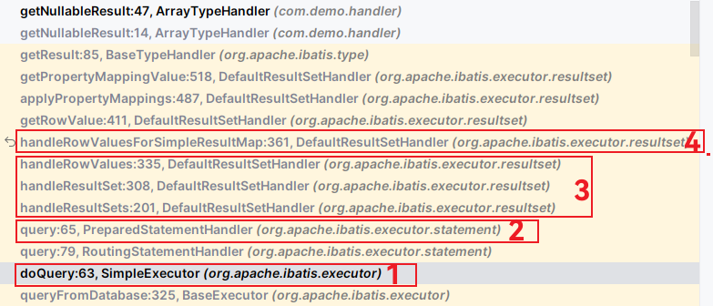

# MyBatis Inspect


## TypeHandler

先来看一下应用场景：在使用 MyBatis 操作 PostgrelSQL 的时候，PostgreSQL 本身是支持数组类型的，例如：

```postgresql
create table (
    int_arr int4[],
    float_arr float4[],
    double_arr float8[],
    vc_arr varchar[],
    ...
);
```

但是 MyBatis 没有做相关的数据映射，导致在数据库中设置为数组类型的列返回值都是 `null`。因此就需要自定义 `TypeHandler` 来应对这种情况。

---

MyBatis 在设置预处理语句（PreparedStatement）中的参数，或从结果集（ResultSet）中取出一个值时， 都会用类型处理器将获取到的值以合适的方式转换成 Java 类型。可以参考 `BooleanTypeHandler` 来理解：

```java
public class BooleanTypeHandler extends BaseTypeHandler<Boolean> {
  // 设置 PreparedStatement 参数
  @Override
  public void setNonNullParameter(PreparedStatement ps, int i, Boolean parameter, JdbcType jdbcType)
      throws SQLException {
    ps.setBoolean(i, parameter);
  }

  // 从 ResultSet 获取结果，转成 Boolean
  @Override
  public Boolean getNullableResult(ResultSet rs, String columnName)
      throws SQLException {
    boolean result = rs.getBoolean(columnName);
    return !result && rs.wasNull() ? null : result;
  }
}
```

常见的类型以及默认的类型处理器如下：

| 类型处理器              | Java 类型                      | JDBC 类型                            |
| :---------------------- | :----------------------------- | :----------------------------------- |
| `BooleanTypeHandler`    | `java.lang.Boolean`, `boolean` | 数据库兼容的 `BOOLEAN`               |
| `ByteTypeHandler`       | `java.lang.Byte`, `byte`       | 数据库兼容的 `NUMERIC` 或 `BYTE`     |
| `ShortTypeHandler`      | `java.lang.Short`, `short`     | 数据库兼容的 `NUMERIC` 或 `SMALLINT` |
| `IntegerTypeHandler`    | `java.lang.Integer`, `int`     | 数据库兼容的 `NUMERIC` 或 `INTEGER`  |
| `LongTypeHandler`       | `java.lang.Long`, `long`       | 数据库兼容的 `NUMERIC` 或 `BIGINT`   |
| `FloatTypeHandler`      | `java.lang.Float`, `float`     | 数据库兼容的 `NUMERIC` 或 `FLOAT`    |
| `DoubleTypeHandler`     | `java.lang.Double`, `double`   | 数据库兼容的 `NUMERIC` 或 `DOUBLE`   |
| `BigDecimalTypeHandler` | `java.math.BigDecimal`         | 数据库兼容的 `NUMERIC` 或 `DECIMAL`  |
| `StringTypeHandler`     | `java.lang.String`             | `CHAR`, `VARCHAR`                    |

可以重写已有的类型处理器或创建你自己的类型处理器来处理不支持的或非标准的类型。 具体做法为：

* 实现 `org.apache.ibatis.type.TypeHandler` 接口；
* 或继承 `org.apache.ibatis.type.BaseTypeHandler`， 并且可以（可选地）将它映射到一个 JDBC 类型。

比如：

```java
import java.sql.Array;

@MappedJdbcTypes({JdbcType.INTEGER, JdbcType.FLOAT, JdbcType.DOUBLE, JdbcType.CHAR, JdbcType.VARCHAR}) // 指定关联的 JDBC 类型，处理这些类型的数组
public class ArrayTypeHandler extends BaseTypeHandler<Object[]> {
    // 插入数据时会调用 setNonNullParameter
    @Override
    public void setNonNullParameter(PreparedStatement ps, int i, Object[] objects, JdbcType jdbcType) throws SQLException {
        Connection connection = ps.getConnection();
        /*
         以下面的 mapper 语句为例子：
         <insert id="insertWithArray">
            insert into tb_ts(time, id, arr, arr_fl)
            values(
                #{timestamp},
                #{id},
                #{arr, jdbcType=INTEGER, typeHandler=com.demo.handler.ArrayTypeHandler},
                #{arrFl, jdbcType=FLOAT, typeHandler=com.demo.handler.ArrayTypeHandler}
            );
         </insert>
         当 MyBatis 解析到 #{arr, jdbcType=INTEGER, typeHandler=com.demo.handler.ArrayTypeHandler} 这句代码，
         就会调用 ArrayTypeHandler 来处理 arr 这个列，并传入 jdbcType=INTEGER 等相关数据。

         在这里使用 jdbcType.name() 我们会获取到 @MappedJdbcTypes 中预定义的 JDBC 类型名称，
         java.sql.Connection.createArrayOf 会根据传入的 typeName 参数创建不同类型的 PGArray 对象。
         PGArray 对象是 java.sql.Array 的子类。
         */
        Array array = connection.createArrayOf(jdbcType.name(), objects);
        ps.setArray(i, array);
    }

    /* 获取数据时会调用下面的方法 */
    @Override
    public Object[] getNullableResult(ResultSet rs, String columnName) throws SQLException {
        return getArray(rs.getArray(columnName));
    }
    @Override
    public Object[] getNullableResult(ResultSet rs, int columnIndex) throws SQLException {
        return getArray(rs.getArray(columnIndex));
    }
    @Override
    public Object[] getNullableResult(CallableStatement cs, int columnIndex) throws SQLException {
        return getArray(cs.getArray(columnIndex));
    }
    private Object[] getArray(Array array) throws SQLException {
        if (array == null) {
            return null;
        }
        return (Object[]) array.getArray();
    }
}
```

自定义好 TypeHandler 之后就可以开始配置：

1、配置

```yaml
mybatis-plus:
  ...
  type-handlers-package: com.demo.handler # TypeHandler 扫描路径，SqlSessionFactoryBean 会把该包下面的类注册为对应的 TypeHandler
```

2、Mapper XML

```xml
<?xml version="1.0" encoding="UTF-8" ?>
<!DOCTYPE mapper
        PUBLIC "-//mybatis.org//DTD Mapper 3.0//EN"
        "https://mybatis.org/dtd/mybatis-3-mapper.dtd">
<mapper namespace="com.demo.mapper.TbTsMapper">

    <insert id="insertWithArray">
        insert into tb_ts(time, id, arr, arr_fl)
        values(
            #{timestamp},
            #{id, jdbcType=INTEGER},
            #{arr, jdbcType=INTEGER, typeHandler=com.demo.handler.ArrayTypeHandler},
            #{arrFl, jdbcType=FLOAT, typeHandler=com.demo.handler.ArrayTypeHandler}
        );
    </insert>

    <resultMap id="arrayResultMap" type="tbTs">
        <id column="time" property="time" />
        <result column="id" property="id" />
        <result column="arr" property="arr" typeHandler="com.demo.handler.ArrayTypeHandler" />
        <result column="arr_fl" property="arrFl" typeHandler="com.demo.handler.ArrayTypeHandler" />
    </resultMap>

    <select id="selectWithArray" resultType="list" resultMap="arrayResultMap">
        select * from tb_ts;
    </select>
</mapper>
```

接下来就可以使用 `insertWithArray` 和 `selectWithArray` 这两个方法测试了。

---

TypeHandler 如期工作，你可能会对它是如何工作的产生疑问。接下来继续深入。

以 SpringBoot 集成 MyBatis 为例，在 `MybatisAutoConfiguration#sqlSessionFactory` 方法中设置 TypeHandler：

```java
if (StringUtils.hasLength(this.properties.getTypeHandlersPackage())) {
    factory.setTypeHandlersPackage(this.properties.getTypeHandlersPackage());
}
if (!ObjectUtils.isEmpty(this.typeHandlers)) {
    factory.setTypeHandlers(this.typeHandlers);
}
```

何时生效呢？调用 `selectWithArray` 获取结果，观察方法调用栈：



从调用栈不妨大胆猜测一番：

1、执行器执行完 SQL 之后将返回值赋值给 PreparedStatementHandler 处理；

2、PreparedStatementHandler 调用 DefaultResultSetHandler 进一步处理返回值；

3、DefaultResultSetHandler 如果发现 XML 方法设置了 ResultMap，则使用 ResultMap 来接收返回值；

4、最后调用 BaseTypeHandler 来处理 JDBC 与 Java 数据类型的关系映射。

接下来在调用栈的关键方法处打上断点查阅关键代码，印证猜想：

* DefaultResultSetHandler 使用 `for` 循环处理每一个结果行的 TypeHandler；


> 提出问题：ArrayTypeHandler 是否可以做成 Plugin 形式？就不需要每次都在 XML 中手动设置。


> **参考**
>
> * https://mybatis.org/mybatis-3/zh/configuration.html